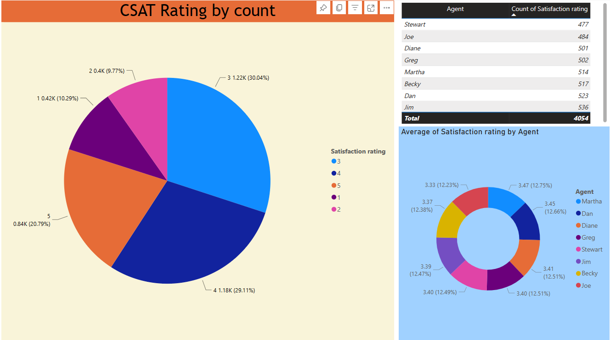

# Call Center Trends Dashboard

The call center manager cannot see the trends and it seems on an assumption, the telecom company is losing their customer and they want to know the reason.

## Task

Create a dashboard in Power BI for the compay that reflects all relevant Key Performance Indicators (KPIs) and metrics in the dataset

Possible KPI's

* Overall customer satisfaction
* Overall calls answered/abandoned
* Calls by time
* Average speed of answer
* Agent’s performance quadrant -> average handle time (talk duration) vs calls answered

## Link to view Dashboard

<a href="https://app.powerbi.com/groups/me/reports/d1af3159-2d02-4764-8d72-fe000712b654/ReportSection?experience=power-bi" target="_blank">Call Center Trends Dashboard</a>

